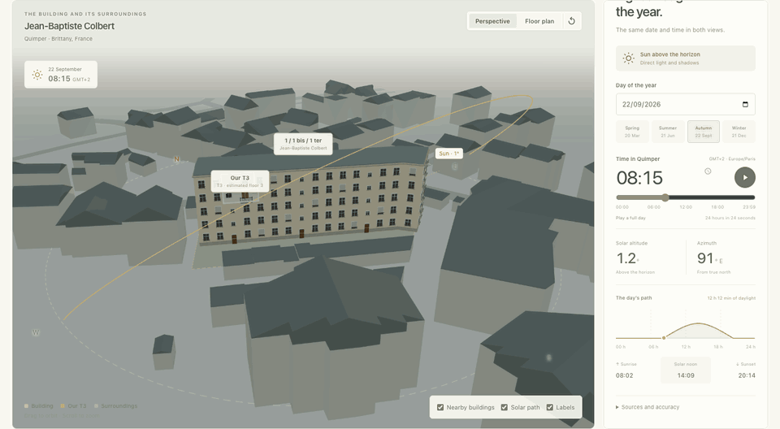

# T3 Designer

**Explore the space. Follow the light. See the bigger picture.**

A 3D workspace for understanding a home, from its rooms to the surrounding
neighbourhood. Explore the property, watch daylight move through its windows,
and keep the sources and open questions close at hand.

The target reconstruction is **Casa 2071** in Castelar, Buenos Aires. The
existing T3/Quimper scene is still present while the project is being migrated;
see [the initial import and task list](specs/001-initial-imports/TASKS.md) for the
imported references and remaining work.

## Proyecto objetivo: Casa 2071

- **Dirección:** Av. Estanislao Zeballos 2071, Castelar, partido de Morón,
  Buenos Aires, Argentina.
- **Otro acceso indicado:** Gobernador Dardo Rocha 877.
- **Lotes de referencia:** 8 y 10, según la captura de Carto GBA de ARBA:
  <https://carto.arba.gov.ar/cartoArba/>.
- La casa está construida y se va a refaccionar. El catastro y el render/modelo
  Blender aportados representan la vivienda completa y sus medidas; ese estado
  existente es la base del proyecto. El plano tentativa marca solo la parte que
  cambia, no toda la casa. El patio, la pileta, el jardín, los accesos, el resto
  de la vivienda y el límite completo del terreno quedan como están. El terreno
  no se subdividió. La aplicación debe mostrar la casa terminada en las pestañas
  existentes, sin pestaña «Casa 2071» ni modo antes/después.
- La carpeta [specs/001-initial-imports](specs/001-initial-imports/TASKS.md) conserva el
  único Blender que corresponde a la impresión compartida, las referencias
  locales (incluidas las seis fotos de fachada) y el plan de trabajo. Las otras
  dos variantes no se importaron por ser incorrectas.
- La siguiente etapa técnica está planificada en
  [specs/002-libs-refactor](specs/002-libs-refactor/TASKS.md): modelo arquitectónico
  versionado, validación, snapshots compartidos y adaptación gradual de Web y
  Blender.

## Estado de Casa 2071

El primer prototipo web agregó por error una pestaña separada, mostró la imagen
tentativa marcada y convirtió solo sus trazas parciales en una volumetría sin
escala. Esa pestaña ya se retiró. **Casa 2071 es ahora el proyecto por defecto
en las tres vistas existentes**: Departamento, Edificio y sol, y Documentación.
Las dos primeras muestran la escena Blender completa aportada, exportada a GLB;
Documentación reúne los planos, seis fotos de fachada, referencia parcelaria,
procedencia y pendientes. El demo T3/Quimper se conserva con `?project=t3`.

Este es un puente visual fiel al archivo Blender, todavía no un renderer del
snapshot arquitectónico canónico: el mapeo exacto de ambientes, la ubicación
verificada, la reconciliación de planta alta y la geometría parcelaria legal
siguen pendientes. El contorno Blender indica «no mensura»; Street View sirve
como contexto cercano, no como mensura ni identificación confirmada de fachada.
El plano tentativo documenta solo el sector de refacción y no se usa para
fabricar geometría.


[Quick start](#quick-start) · [Take a tour](#take-a-tour) · [How it works](#how-it-works) · [Documentation](docs/README.md)

## Take a tour

### Watch a day unfold

Scrub the timeline or press play to follow sunlight through the apartment and
across the surrounding buildings. Jump between seasons, focus on a room, and
switch between interior and exterior views without losing the selected moment.
The solar path, altitude chart and sunrise/sunset times tell the same story at
different scales.



*Solar time follows Quimper's `Europe/Paris` timezone, including daylight-saving
changes. Nighttime disables direct sunlight.*

### From rooms to neighbourhood

- **Inspect the apartment.** Switch between perspective and floor plan, focus on
  individual rooms, and toggle cutaways, fixtures and labels. Browse the fixture
  catalog for dimensions, source references and individual GLB downloads.
- **Put it in context.** Explore the surrounding building volumes, locate the
  apartment, then reveal its floor or interior. Camera cutaways preserve the
  shadows of walls, ceilings and neighbouring buildings.
- **Read the evidence.** The property dossier brings together public records,
  reported areas, visual observations, source links and unresolved questions.
  Its bundled content is available alongside the model without a database setup.

| Building and sun | Property dossier |
| --- | --- |
|  |  |
| Reveal the apartment inside its building and surroundings. | Follow the sources behind the reconstruction. |

The interface is available in **English and Spanish**, with **light, dark and
system themes**. Open **Settings** to choose your appearance and language;
preferences are saved in your browser. Privacy/analytics controls and the French
locale are not included; the solar study and all original workspace controls are.

## Quick start

Use **Node.js 24+**, **pnpm 12.7.0** (the repository pin), and a browser with
WebGL 2 enabled.

```sh
pnpm install
pnpm dev
```

Open the Vite URL shown in the terminal, normally
[localhost:5173](http://localhost:5173).

**Drag** to orbit · **Scroll** to zoom · **Right-drag** to pan

A good first lap:

1. In **Apartment → Sun**, focus the **Living room** and move the time slider.
2. Compare **Summer** and **Winter** to see how the light changes.
3. Try **Floor plan**, then toggle **Cutaway** or **Show building**.
4. Open **Building and sun** and choose **Floor cutaway** or **Show interior**.
5. Visit **Documentation** to explore the property dossier and its sources.

The browser app uses the checked-in model, GLBs and geographic extract. Blender
is optional. The solar controls calculate locally; changing the date or time
does not call an external API.

## How it works

**One metric model, two rendering workflows.** React and Three.js provide the
interactive view. A validated JSON snapshot carries the apartment, fixtures,
building context and selected sun position into Blender for offline rendering.

Rooms, walls, openings and placements remain editable TypeScript data. The app
loads individual GLBs for fixtures; the apartment is not stored as a single
opaque mesh. Layout changes currently happen in the source data.

| Where | What it owns |
| --- | --- |
| [`apps/web`](apps/web) | React UI, Three.js scenes, translations and materials |
| [`apps/web/src/data`](apps/web/src/data) | Apartment geometry, fixtures, building context, placement and dossier |
| [`apps/web/src/lib/solar.ts`](apps/web/src/lib/solar.ts) | Shared sun geometry and Quimper civil-time conversion |
| [`packages/scene-schema`](packages/scene-schema) | Domain validation and the versioned project contract |
| [`packages/geometry`](packages/geometry) | Renderer-independent polygons, bounds and wall segmentation |
| [`packages/architecture-model`](packages/architecture-model/README.md) | Versioned architectural contract for complete existing buildings and partial renovations |
| [`scripts/blender`](scripts/blender) | Asset auditing, scene assembly and rendering |

All geometry uses metres. Both rendering workflows share geometry, placement
and solar inputs; materials and renderer settings have their own implementations.
See the [architecture guide](docs/architecture/architecture.md) for data ownership,
coordinate conventions and extension boundaries.

## Development

The complete code and data check also requires **Python 3.10+**:

```sh
pnpm check
```

This runs lint, TypeScript checks, Node and Python tests, read-only snapshot
verification, and the production build. It does not require Blender or MCP.

| Command | Purpose |
| --- | --- |
| `pnpm dev` | Start the Vite development server |
| `pnpm build` | Build the production web app |
| `pnpm test` | Run package, script and Python tests |
| `pnpm scene:verify` | Check tracked snapshots against canonical data without writing |
| `pnpm test:e2e` | Run Playwright browser tests |
| `pnpm check:all` | Run `check` and the browser tests |

For browser tests, install Playwright's Chromium once with
`pnpm --filter @t3-designer/web exec playwright install chromium`.
See [internationalization](docs/architecture/i18n.md) and
[settings](docs/architecture/settings.md) for the browser validation workflows.
The [screenshot capture guide](docs/workflows/readme-media.md) explains how to
regenerate this README's screenshots and animation from the running app.

### Render with Blender

With Blender installed, export the current source data and render the combined
scene in a background process:

```sh
pnpm scene:snapshot    # Refresh the four tracked JSON snapshots
pnpm blender:render    # Assemble the combined scene and render with Cycles CPU
```

The default snapshot uses **2026-09-26 at 15:00, Europe/Paris**, independently of
the browser's selected time. Generated `.blend`, validation and PNG outputs go
under the ignored `artifacts/` directory. Set `BLENDER_BIN` if Blender is not at
the standard macOS location or on `PATH`.

For custom dates, separate output files, asset audits and all render options,
see the [Blender workflow](docs/workflows/blender.md). The background pipeline
works without an open Blender window or an MCP connection.

### Live Blender and Street View MCPs

The VS Code MCP configuration is in `.vscode/mcp.json`. Start the servers with
**MCP: List Servers**. Blender is available at `/usr/local/bin/blender`; for
live editing, keep Blender open and start the matching **MCP for Blender** add-on
from the 3D Viewport sidebar (`N`). The Blender MCP socket is restricted to
localhost and safe mode is enabled. Google Street View asks for its API key via
a local `GOOGLE_API_KEY` entry in the ignored `.env`; the launcher passes it to
the MCP server without printing or storing it in MCP configuration. Enable the
Street View Static API for that key. The MCP exposes panorama metadata and
on-demand images. Metadata requests are free; image requests may be billable, so
request only images that are needed and avoid repeated or bulk requests. Every
outbound metadata/image request is counted locally in
`artifacts/street-view-usage.sqlite3` (ignored by Git); use the
`get_street_view_usage` MCP tool to check lifetime and current-month counts.
The counter records timestamps and request type only, not locations, API keys,
or image data. It is a monitor, not a hard limit; configure a Google Cloud API
quota if requests must be capped. See Google's
[metadata billing note](https://developers.google.com/maps/documentation/streetview/metadata)
and [Street View billing details](https://developers.google.com/maps/documentation/streetview/usage-and-billing).
The Street View adapter's pinned Python dependencies are declared in
[`scripts/requirements-mcp.txt`](scripts/requirements-mcp.txt).

## About the reconstruction

This is an evolving, evidence-based reconstruction of one apartment. **Its
dimensions and building placement are approximate.** The reported room areas
sum to **49.18 m²**, but the model is not a measured net-area survey.

The building context uses a local extract of **99 building footprints**,
source heights, roads and the cadastral parcel. Apartment orientation, facade
openings, roof forms and some fixture dimensions are inferred. Ground is flat;
terrain, distant obstructions, clouds and vegetation are outside the current
model. The exact bathroom layout still needs measurements, and the basement
has not been reconstructed.

Sunlight and shadows are a **visual study**, not a certified insolation, energy
or measured irradiance report. The dossier distinguishes reported facts,
observations and pending evidence; apartment-specific diagnostics and legal-lot
confirmation remain open.

For the underlying assumptions, see [apartment geometry](docs/model/apartment-geometry.md),
[building placement](docs/model/apartment-placement.md),
[solar calculations and limits](docs/model/solar-model.md), and
[source provenance](docs/reference/evidence.md).

## Documentation

The [documentation index](docs/README.md) brings together the architecture,
research, workflows and checkpoints. Start with:

- [Building research and data attribution](docs/research/building-research.md)
- [Property dossier scope and sources](docs/research/property-dossier.md)
- [Blender commands and preserved reference scenes](docs/workflows/blender.md)
- [Casa BIM delivery workflow](docs/workflows/casa-bim.md)

The application does not display privacy/analytics controls or send analytics
requests. Its three project workspaces, solar study, and theme/language settings
remain available.

## License and attribution

Original code, documentation, authored 3D geometry and generated textures are
available under the [MIT License](LICENSE). Copyright © 2026 Pablo Coronel.
Forks, modifications and commercial use are welcome; retain the required
copyright and license notices.

If you build on this work, credit **T3 Designer by Pablo Coronel (pablitxn)** and
link to the original repository. This is appreciated, not an additional license
condition.

Third-party dependencies, public datasets and externally supplied reference
material retain their own licenses and rights. Preserve the source attribution
and retrieval dates documented in the [building research](docs/research/building-research.md)
and [reference evidence](docs/reference/evidence.md).
